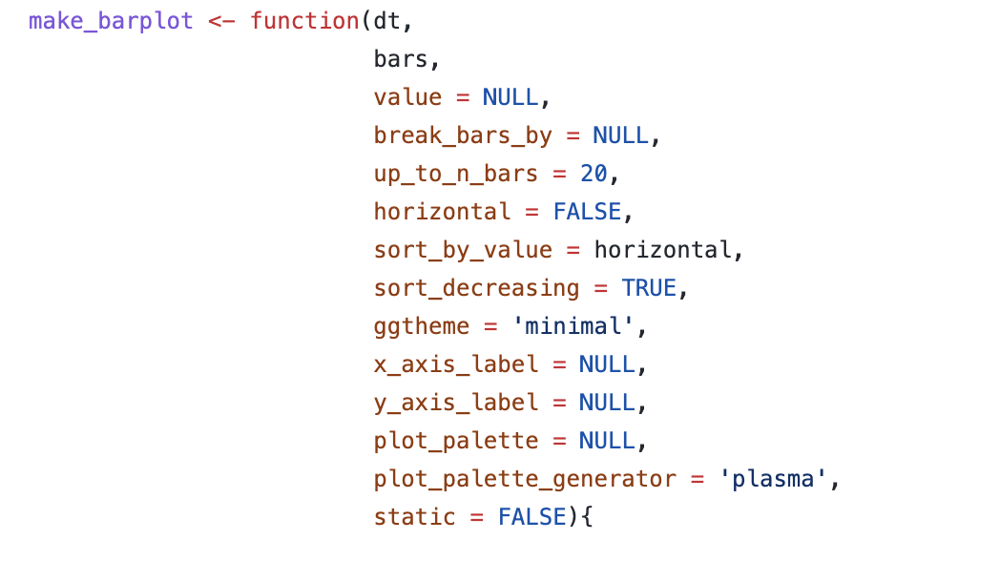
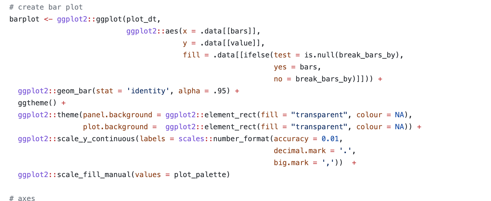

```{r setup, include=FALSE}
knitr::opts_chunk$set(echo = FALSE)
```

```{r,  warning=FALSE, message=FALSE}
library(tidyverse)
```

## About me

.left-column[<br> <br> 
] 
.right-column[
* Data Science Practitioner/ Freelancer
    * Data Science Consultant with OnPoint Insights
    * TA for Applied Linear Modelling at Upenn
* Avid R user and active community member (RLadies and R4DS)
* MS, Applied Economics from Boston College
* B.Tech and MBA in India
* Women in DS, Women in Analytics Ambassador

Contact: <br>
Twitter: @priyankaigit <br>
Linkedin: priyanka-gagneja <br>
Blog: https://fun-with-data.netlify.app/
]

---

## Motivation


Doing lots of Exploratory projects

   - Repetitive
   
   - Taking so much time 
   
      - No time for insights

---


class: center, middle, inverse
## Absolute first steps

---

## Packages I discovered

#### Absolute first steps

- [{DataExplorer}](https://cran.r-project.org/web/packages/DataExplorer/vignettes/dataexplorer-intro.html)

    - aims to perform and simplify the 3 main goals throughout the data exploration process - Exploratory Data Analysis (EDA), Feature Engineering and Data Reporting
    
    - `create_report(txhousing)`

--
- [{DataReporter}](https://github.com/ekstroem/dataReporter)

    - thorough summary of the data checks and the results that make it easy to identify possible errors
    
    - `makeDataReport(txhousing)`

--
- [{skimr}](https://cran.r-project.org/web/packages/skimr/vignettes/skimr.html) 

    - provide summary statistics about variables with easy to modify defaults
    
    - `skim(txhousing)`

---

class: center, middle, inverse
## Further Exploration

---

## Packages I discovered contd...
#### Further Exploration

- [{rpivotTable}](https://github.com/smartinsightsfromdata/rpivotTable)

- [{esquisse}](https://cran.r-project.org/web/packages/esquisse/vignettes/get-started.html)

- [{chronicle}](https://github.com/pheymanss/chronicle) (Thanks to useR!2021)

---
## {rpivotTable}

**Allows**     

- Quick & Dirty Data Exploration        

--

**Demo**
```{r echo = TRUE, eval=FALSE}
library(rpivotTable)

ggplot2::txhousing %>%
    rpivotTable::rpivotTable()
```

--
**Benefits**     

- More than just counts, more like pivot

- Pipeable

--

**Limitations**     

- No code 

- Colors

---
## {esquisse} 

**Allows**     
- Quick Exploration   
- Wrangling on the go    
- Code Generation   

--

**Demo**
```{r cars, echo = TRUE, eval=FALSE}
library(esquisse)
esquisse::esquisser()
```

Brings up a new window, shiny-app based.

--

**Benefits**     

- Code generated for each action
    - can be sent to script or console

--

**Limitations**     

- Does not provide much of summaries 

- Limited plot options


---
## {chronicle}

**Allows**     

- Quick Exploration   
- Report Generation   

---
## {chronicle}

**Demo**

.pull-left[]
.pull-right[]


---
## {chronicle}

**Demo**
- add_* functions
    - make_* functions 
- render_report()
    - rmarkdown::render()
- report_columns()
    - skimr::skim()


--

**Benefits**     

- reduces the time to generate plots (without getting into ggplot2 layering detail)
- can generate reports in multiple formats with one rendering action

--

**Limitations**     

- No ggplot code per se


---

## Resources/References

https://cran.r-project.org/web/packages/DataExplorer/vignettes/dataexplorer-intro.html

https://github.com/ekstroem/dataReporter

https://cran.r-project.org/web/packages/skimr/vignettes/skimr.html


https://github.com/smartinsightsfromdata/rpivotTable

https://cran.r-project.org/web/packages/esquisse/vignettes/get-started.html

https://github.com/pheymanss/chronicle


For the bonus packages
https://choonghyunryu.github.io/dlookr/articles/introduce.html

https://descriptr.rsquaredacademy.com/

---

## Bonus

- [{dlookr}](https://choonghyunryu.github.io/dlookr/articles/introduce.html)

- [{descriptr}](https://descriptr.rsquaredacademy.com/)

---

class: center, middle
## Thank You !!